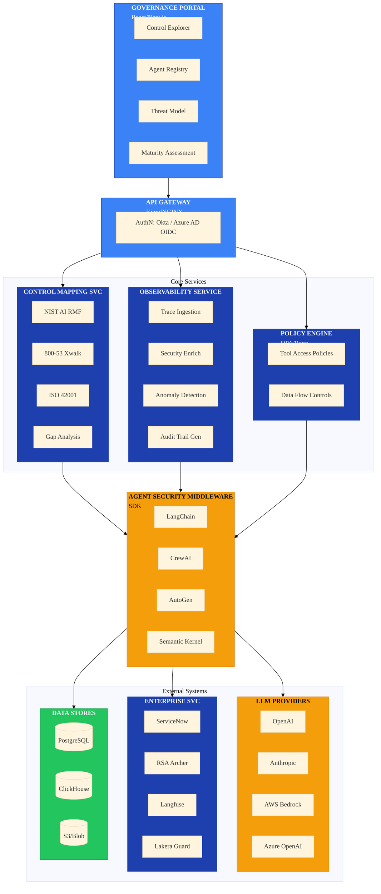

# AgentGuard


**AI Security Governance Framework for Agentic Systems**

AgentGuard is a comprehensive security framework and reference implementation for governing AI agents in enterprise environments. It provides control mapping to established frameworks (NIST AI RMF, ISO 42001), runtime observability for agent execution chains, and policy-as-code guardrails for AI system deployments.

---

## Table of Contents

- [Implementation Status](#-implementation-status)
- [Known Limitations](#-known-limitations)
- [What This Solves](#-what-this-solves)
- [Vendor Landscape Analysis](#-vendor-landscape-analysis)
- [Architecture](#-architecture)
- [Repository Structure](#-repository-structure)
- [Key Features](#-key-features)
- [Tech Stack](#-tech-stack)
- [Quick Start](#-quick-start)
- [Documentation](#-documentation)
- [Security Considerations](#-security-considerations)
- [Roadmap](#-roadmap)
- [License](#license)
- [Contributing](#contributing)

---

## [/] Implementation Status

> **Current State:** Early development (~25% complete). Core framework structures defined, API handlers stubbed.

| Component | Status | Notes |
|-----------|--------|-------|
| **Control Frameworks** | | |
| NIST AI RMF definitions | Done | Complete control taxonomy in YAML |
| NIST 800-53 crosswalks | Done | Bidirectional mapping implemented |
| ISO 42001 mapping | Not Started | Framework placeholder only |
| **API Layer** | | |
| HTTP handlers | Stubbed | Endpoints defined, no business logic |
| Authentication (OIDC) | Not Started | Interface defined |
| Rate limiting | Not Started | |
| **Data Layer** | | |
| PostgreSQL models | Not Started | Schema designed, no implementation |
| ClickHouse telemetry | Not Started | |
| Migrations | Not Started | |
| **SDK** | | |
| Python SDK | Not Started | Interface designed |
| TypeScript SDK | Not Started | |
| Go SDK | Not Started | |
| **Observability** | | |
| OTEL integration | Partial | Telemetry structs defined |
| Langfuse integration | Not Started | |
| Security enrichment | Not Started | |
| **Policy Engine** | | |
| OPA integration | Not Started | Rego policies drafted |
| Tool access policies | Not Started | |
| **Testing** | | |
| Unit tests | 0% | No test coverage |
| Integration tests | 0% | |

---

## [!] Known Limitations

This is a **portfolio reference implementation**, not production software:

1. **No Database Layer** - Schema designed but PostgreSQL/ClickHouse connections not implemented
2. **Stubbed Handlers** - API routes exist but return placeholder responses
3. **No Authentication** - OIDC interface defined but no provider integration
4. **No SDK Packages** - SDK designs exist in `sdk/` but not published to PyPI/npm
5. **Zero Test Coverage** - No unit or integration tests yet
6. **No CI/CD Pipeline** - Build automation not configured
7. **Langfuse/Lakera** - Integration interfaces only, no working clients

**Production Requirements:**
- Implement database repositories and migrations
- Complete API handler business logic
- Build and publish SDK packages
- Add comprehensive test suites
- Configure CI/CD with security scanning
- Implement authentication middleware

---

## [*] What This Solves

Enterprise AI adoption faces unique security challenges:
- **Security Teams** lack frameworks for assessing AI-specific risks
- **Compliance** needs mapping between AI controls and existing frameworks (FedRAMP, SOC2)
- **Platform Teams** need guardrails for agent tool access and data exposure
- **Audit** requires traceable execution chains for AI decision-making

AgentGuard bridges these needs with:
- Control framework mapping (NIST AI RMF → NIST 800-53 → ISO 42001)
- Agent execution observability (prompt → retrieval → tool calls → output)
- Policy-as-code for AI deployments (OPA/Rego)
- Threat modeling templates for agentic systems
- Maturity model for AI security posture assessment

## [+] Vendor Landscape Analysis

### Build vs. Buy Decision Matrix

| Capability | Vendor Options | Gap Analysis | Decision |
|------------|----------------|--------------|----------|
| **LLM Observability** | LangSmith, Langfuse, Helicone, Arize | Good trace capture, weak on security-specific signals (injection detection, PII exposure, tool abuse) | **Integrate** - Use for base telemetry, extend with security enrichment |
| **AI Guardrails** | Lakera Guard, Prompt Security, AWS Bedrock Guardrails, Azure AI Content Safety | Focus on content safety, not agent-specific risks (tool chaining, privilege escalation) | **Build** - Agent-specific policy engine on top of OPA |
| **Compliance Mapping** | No dedicated tooling | Major gap - no AI RMF to 800-53 crosswalks exist | **Build** - Core differentiator |
| **Agent Frameworks** | LangChain, CrewAI, AutoGen, Semantic Kernel | Mature, but security is afterthought | **Integrate** - Wrap with security middleware |
| **GRC Integration** | ServiceNow, Archer, OneTrust | No AI-specific risk taxonomies | **Extend** - Custom risk types, integrate via APIs |
| **Vector DB Security** | No dedicated tooling | Embedding poisoning, retrieval manipulation unaddressed | **Build** - Novel capability |

### Vendor Deep Dive

#### LLM Observability Platforms

| Vendor | Strengths | Gaps | Integration Path |
|--------|-----------|------|------------------|
| **LangSmith** | Native LangChain integration, excellent trace UI | Closed ecosystem, no security-specific signals | OTEL export → AgentGuard enrichment |
| **Langfuse** | Open source, self-hostable, good cost tracking | Limited security features, no GRC integration | Direct integration, extend with security spans |
| **Helicone** | Simple setup, good latency tracking | No agent-specific features | Proxy mode, augment with security headers |
| **Arize Phoenix** | Strong ML observability heritage, drift detection | LLM features still maturing | Embedding drift detection integration |

**Recommendation:** Langfuse as base observability layer (open source, self-hostable), extended with AgentGuard security enrichment.

#### AI Security / Guardrails

| Vendor | Strengths | Gaps | Integration Path |
|--------|-----------|------|------------------|
| **Lakera Guard** | Prompt injection detection, PII filtering | No agent tool-use controls, no compliance mapping | Pre-processing filter in agent pipeline |
| **Prompt Security** | Enterprise focus, API security | Limited observability, no audit trail | Input validation layer |
| **AWS Bedrock Guardrails** | Native AWS integration, content filters | AWS-only, limited customization | Use for AWS deployments, need multi-cloud |
| **Azure AI Content Safety** | Good content classification | Azure-only, no agent awareness | Use for Azure deployments |

**Recommendation:** Lakera Guard for prompt injection baseline, but build agent-specific policy engine for tool access control and compliance mapping.

#### Why Build AgentGuard?

**Gap 1: No AI-to-Legacy Compliance Crosswalks**
- NIST AI RMF published 2023, but no tooling maps AI controls to existing FedRAMP/SOC2 controls
- Enterprises need to demonstrate AI governance within existing compliance programs
- AgentGuard provides authoritative crosswalks with justification and evidence requirements

**Gap 2: Agent-Specific Threat Model**
- Existing tools focus on LLM content safety (toxicity, PII)
- Agents introduce new attack surfaces: tool abuse, privilege escalation, data exfiltration via retrieval
- AgentGuard provides STRIDE/MITRE ATLAS threat models specific to agentic architectures

**Gap 3: Enterprise GRC Integration**
- No AI security tool integrates with ServiceNow/Archer for risk acceptance workflows
- AgentGuard bridges AI findings to enterprise GRC processes

**Gap 4: Unified Observability + Policy**
- Observability tools (LangSmith) separate from policy tools (Guardrails)
- AgentGuard unifies: observe → detect → enforce → audit in single platform

## [/] Architecture



<details>
<summary>ASCII Diagram (Legacy)</summary>

```
┌─────────────────────────────────────────────────────────────────────────────────┐
│                            AGENTGUARD PLATFORM                                  │
├─────────────────────────────────────────────────────────────────────────────────┤
│                                                                                 │
│  ┌─────────────────────────────────────────────────────────────────────────┐   │
│  │                     GOVERNANCE PORTAL (React/Next.js)                   │   │
│  │  ┌─────────────┐  ┌─────────────┐  ┌─────────────┐  ┌─────────────┐    │   │
│  │  │  Control    │  │   Agent     │  │   Threat    │  │  Maturity   │    │   │
│  │  │  Explorer   │  │  Registry   │  │   Model     │  │  Assessment │    │   │
│  │  └─────────────┘  └─────────────┘  └─────────────┘  └─────────────┘    │   │
│  └─────────────────────────────────────────────────────────────────────────┘   │
│                                        │                                        │
│                                        ▼                                        │
│  ┌─────────────────────────────────────────────────────────────────────────┐   │
│  │                         API GATEWAY (Kong/NGINX)                        │   │
│  │                    AuthN: Okta / Azure AD OIDC                          │   │
│  └─────────────────────────────────────────────────────────────────────────┘   │
│                                        │                                        │
│         ┌──────────────────────────────┼──────────────────────────────────┐    │
│         ▼                              ▼                                  ▼    │
│  ┌─────────────────┐      ┌─────────────────────┐      ┌─────────────────┐    │
│  │    CONTROL      │      │    OBSERVABILITY    │      │  POLICY ENGINE  │    │
│  │  MAPPING SVC    │      │       SERVICE       │      │    (OPA/Rego)   │    │
│  │                 │      │                     │      │                 │    │
│  │ • NIST AI RMF   │      │ • Trace Ingestion   │      │ • Tool Access   │    │
│  │ • 800-53 Xwalk  │      │ • Security Enrich   │      │   Policies      │    │
│  │ • ISO 42001     │      │ • Anomaly Detection │      │ • Data Flow     │    │
│  │ • Gap Analysis  │      │ • Audit Trail Gen   │      │   Controls      │    │
│  └────────┬────────┘      └──────────┬──────────┘      └────────┬────────┘    │
│           │                          │                          │              │
│           └──────────────────────────┼──────────────────────────┘              │
│                                      ▼                                          │
│  ┌─────────────────────────────────────────────────────────────────────────┐   │
│  │                    AGENT SECURITY MIDDLEWARE (SDK)                      │   │
│  │         LangChain | CrewAI | AutoGen | Semantic Kernel                  │   │
│  └─────────────────────────────────────────────────────────────────────────┘   │
│                                      │                                          │
│         ┌────────────────────────────┼────────────────────────────┐            │
│         ▼                            ▼                            ▼            │
│  ┌─────────────────┐      ┌─────────────────┐      ┌─────────────────┐        │
│  │  LLM PROVIDERS  │      │  ENTERPRISE SVC  │      │   DATA STORES   │        │
│  │                 │      │                 │      │                 │        │
│  │ • OpenAI       │      │ • ServiceNow    │      │ • PostgreSQL    │        │
│  │ • Anthropic    │      │ • RSA Archer    │      │ • ClickHouse    │        │
│  │ • AWS Bedrock  │      │ • Langfuse      │      │ • S3/Blob       │        │
│  │ • Azure OpenAI │      │ • Lakera Guard  │      │                 │        │
│  └─────────────────┘      └─────────────────┘      └─────────────────┘        │
│                                                                                 │
└─────────────────────────────────────────────────────────────────────────────────┘
```

</details>

## [/] Repository Structure

```
agentguard/
├── cmd/
│   ├── server/                 # API server entrypoint
│   ├── worker/                 # Background job worker
│   └── cli/                    # Assessment CLI tool
├── internal/
│   ├── api/                    # HTTP handlers
│   ├── config/                 # Configuration management
│   ├── models/                 # Data models
│   ├── controls/               # Control framework definitions
│   │   ├── nist_ai_rmf/        # NIST AI RMF controls
│   │   ├── nist_800_53/        # 800-53 crosswalks
│   │   └── iso_42001/          # ISO 42001 mapping
│   ├── llm/                    # LLM provider abstraction (merged from llm-chat-agent)
│   │   ├── provider.go         # Provider interface
│   │   ├── anthropic.go        # Anthropic Claude
│   │   ├── openai.go           # OpenAI
│   │   └── bedrock.go          # AWS Bedrock
│   ├── vectordb/               # Vector DB abstraction (merged from llm-chat-agent)
│   │   └── provider.go         # Pinecone, Weaviate, Azure Search
│   ├── storage/                # Cloud storage abstraction (merged from llm-chat-agent)
│   │   └── provider.go         # S3, Blob, GCS
│   ├── telemetry/              # LLM telemetry (merged from llm-chat-agent)
│   │   └── telemetry.go        # OTEL integration
│   ├── policy/                 # OPA integration
│   │   ├── engine/             # Policy evaluation
│   │   └── policies/           # Built-in policies
│   ├── threat/                 # Threat modeling
│   │   ├── stride/             # STRIDE analysis
│   │   └── atlas/              # MITRE ATLAS mapping
│   ├── maturity/               # Maturity model assessment
│   └── integrations/           # External integrations
│       ├── langfuse/           # Langfuse client
│       ├── lakera/             # Lakera Guard client
│       └── grc/                # ServiceNow/Archer
├── observability/              # Observability configs (merged from llm-chat-agent)
│   ├── README.md               # Observability guide
│   ├── prometheus/             # Prometheus configs
│   └── grafana/                # Grafana dashboards
├── sdk/
│   ├── python/                 # Python SDK (LangChain, CrewAI)
│   ├── typescript/             # TypeScript SDK
│   └── go/                     # Go SDK
├── frameworks/
│   ├── controls/               # Control definitions (YAML)
│   │   ├── nist-ai-rmf.yaml
│   │   ├── nist-800-53-crosswalk.yaml
│   │   └── iso-42001-mapping.yaml
│   ├── threat-models/          # Threat model templates
│   │   ├── agentic-system.yaml
│   │   └── rag-pipeline.yaml
│   └── maturity-model/         # Maturity assessment
│       └── ai-security-maturity.yaml
├── policies/                   # OPA/Rego policies
│   ├── tool-access/            # Tool invocation policies
│   ├── data-flow/              # Data exposure policies
│   └── prompt-injection/       # Injection detection
├── docs/
│   ├── HLD.md                  # High-Level Design
│   └── adr/                    # Architecture Decision Records
├── infra/
│   ├── terraform/              # Infrastructure as Code
│   └── k8s/                    # Kubernetes manifests
├── examples/
│   ├── langchain-agent/        # LangChain integration example
│   └── crewai-workflow/        # CrewAI integration example
├── Dockerfile
├── docker-compose.yml
├── Makefile
└── README.md
```

> **Merged from `llm-chat-agent`:** LLM provider abstraction, vector DB, cloud storage, telemetry, and observability modules now integrated for a complete AI security platform.


## [+] Key Features


### Control Framework Mapping

- NIST AI RMF control definitions with evidence requirements
- Bidirectional crosswalks to NIST 800-53 (FedRAMP alignment)
- ISO 42001 mapping for international compliance
- Gap analysis reporting for audit preparation


### Agent Observability

- SDK middleware for LangChain, CrewAI, AutoGen, Semantic Kernel
- Full execution chain tracing (prompt → retrieval → tool calls → output)
- Security signal enrichment (injection attempts, PII exposure, tool abuse)
- Integration with Langfuse for base telemetry


### Policy-as-Code

- OPA/Rego policies for agent deployments
- Tool access control (least privilege per agent capability)
- Data flow policies (PII/sensitive data handling)
- Prompt injection detection and blocking

### Threat Modeling
- STRIDE analysis templates for agentic systems
- MITRE ATLAS attack mapping
- Attack tree generation for common agent architectures
- Risk scoring with business context

### Maturity Assessment
- 5-level maturity model for AI security posture
- Self-assessment questionnaire
- Benchmark comparison
- Roadmap generation for maturity improvement


## [+] Tech Stack

| Component | Technology | Purpose |
|-----------|------------|---------|
| API Server | Go 1.22+ | Core platform API |
| Portal | React 18 + Next.js 14 | Governance UI |
| Policy Engine | OPA / Rego | Guardrails, validation |
| Observability | OpenTelemetry | Trace collection |
| Time-Series | ClickHouse | Trace storage, analytics |
| Database |  PostgreSQL | Control mappings, assessments |
| SDK | Python, TypeScript, Go | Agent framework integration |

## [>] Quick Start

### Prerequisites
- Go 1.22+
- Docker & Docker Compose
- OPA CLI
- Python 3.11+ (for SDK examples)

### Local Development

```bash
# Clone repository
git clone https://github.com/yourusername/agentguard.git
cd agentguard

# Start dependencies (Postgres, ClickHouse, OPA)
docker-compose up -d

# Run migrations
make migrate

# Start API server
make run

# Run example agent with SDK
cd examples/langchain-agent
pip install -r requirements.txt
python main.py
```

### SDK Installation

```bash
# Python
pip install agentguard-sdk

# TypeScript
npm install @agentguard/sdk
```

### Basic Usage (Python/LangChain)

```python
from langchain.agents import create_openai_tools_agent
from agentguard import AgentGuardMiddleware, PolicyConfig

# Initialize middleware
middleware = AgentGuardMiddleware(
    api_url="http://localhost:8080",
    policy_config=PolicyConfig(
        allowed_tools=["web_search", "calculator"],
        data_classification="internal",
        require_human_approval=["file_write", "email_send"]
    )
)

# Wrap agent executor
agent_executor = middleware.wrap(agent_executor)

# All invocations now traced and policy-enforced
result = agent_executor.invoke({"input": "Search for Q3 sales data"})
```

## [>] Documentation

- [High-Level Design](docs/HLD.md)
- [Control Framework Reference](docs/controls.md)
- [Threat Modeling Guide](docs/threat-model.md)
- [SDK Integration Guide](docs/sdk.md)
- [Policy Authoring Guide](docs/policies.md)

### Architecture Decision Records
- [ADR-001: Observability Strategy](docs/adr/ADR-001-observability-strategy.md)
- [ADR-002: Control Framework Selection](docs/adr/ADR-002-control-framework-selection.md)
- [ADR-003: Policy Engine Selection](docs/adr/ADR-003-policy-engine-selection.md)
- [ADR-004: Vendor Integration Strategy](docs/adr/ADR-004-vendor-integration-strategy.md)


## [!] Security Considerations

- All API endpoints require authentication (OIDC)
- Service-to-service communication uses mTLS
- Trace data encrypted at rest and in transit
- PII detected in traces automatically redacted
- Audit logging for all policy evaluations

## [>] Roadmap

### Phase 1: Framework Foundation (Current)
- [x] NIST AI RMF control definitions
- [x] NIST 800-53 crosswalk mapping
- [x] Control taxonomy YAML structure
- [ ] ISO 42001 mapping
- [ ] Gap analysis CLI tool
- [ ] Database layer implementation
- [ ] API handler business logic


### Phase 2: Observability

- [ ] Python SDK (LangChain, CrewAI middleware)
- [ ] TypeScript SDK
- [ ] OTEL trace ingestion pipeline
- [ ] Security signal enrichment
- [ ] Langfuse integration
- [ ] ClickHouse telemetry storage


### Phase 3: Policy Engine

- [ ] OPA integration and policy evaluation
- [ ] Tool access policies (Rego)
- [ ] Data flow policies
- [ ] Prompt injection detection
- [ ] Runtime policy enforcement

### Phase 4: Governance Portal
- [ ] Control explorer UI (React/Next.js)
- [ ] Agent registry
- [ ] Maturity assessment wizard
- [ ] Audit report generation
- [ ] Dashboard analytics

### Phase 5: Enterprise Integration
- [ ] ServiceNow GRC integration
- [ ] RSA Archer integration
- [ ] Lakera Guard integration
- [ ] SIEM export (Splunk, Sentinel)
- [ ] OIDC authentication (Okta/Entra ID)

## License

Apache 2.0 License - See [LICENSE](LICENSE)

## Contributing

Contributions welcome! Please read [CONTRIBUTING.md](CONTRIBUTING.md) first.

---

**Note:** This is a reference architecture and portfolio project demonstrating AI security governance patterns. Production deployments require additional hardening, testing, and customization for your organization's specific requirements.
