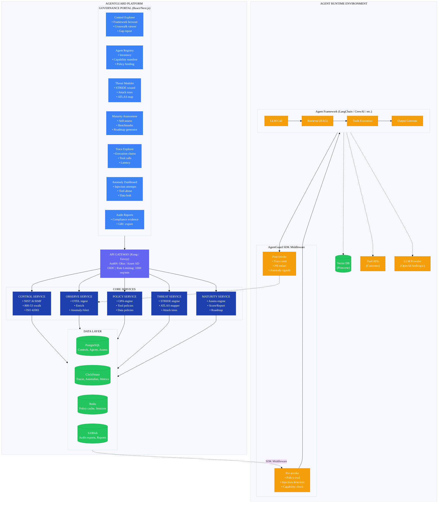

#  AgentGuard — High-Level Design Document

**Version:** 1.0
**Author:** Liem Vo-Nguyen
**Date:** January 2026
**Status:** Draft

---

## Table of Contents

- [Executive Summary](#executive-summary)
- [Market Analysis and Build/Buy Rationale](#market-analysis-and-buildbuy-rationale)
- [Architecture Overview](#architecture-overview)
- [Component Specifications](#component-specifications)
  - [Control Mapping Service](#1--control-mapping-service)
  - [Observability Service](#2--observability-service)
  - [Policy Service](#3--policy-service)
  - [Threat Modeling Service](#4--threat-modeling-service)
  - [Maturity Assessment Service](#5--maturity-assessment-service)
- [API Specification](#api-specification)
- [SDK Integration](#sdk-integration)
- [Roadmap](#roadmap)

---

## Executive Summary

AgentGuard is an AI security governance framework that addresses the unique risks of agentic AI systems in enterprise environments. It provides control mapping to established compliance frameworks, runtime observability for agent execution chains, and policy-as-code guardrails—capabilities that do not exist in current vendor offerings.

**Key Differentiators:**
- First comprehensive NIST AI RMF → NIST 800-53 crosswalk for FedRAMP-aligned organizations
- Agent-specific threat modeling beyond content safety (tool abuse, privilege escalation, data exfiltration)
- Unified observability + policy enforcement in single platform
- SDK middleware for major agent frameworks (LangChain, CrewAI, AutoGen)
- Enterprise GRC integration for AI risk acceptance workflows

**Target Users:**
- Security Architects evaluating AI deployment risks
- Compliance Teams mapping AI controls to existing frameworks
- Platform Engineers building internal AI platforms
- Auditors assessing AI governance posture

---

## Market Analysis and Build/Buy Rationale

### Vendor Landscape Deep Dive

#### Category 1: LLM Observability

| Vendor | Pricing | Strengths | Gaps | Verdict |
|--------|---------|-----------|------|---------|
| **LangSmith** | $39/seat + usage | Best LangChain integration, excellent trace UI, prompt playground | Closed ecosystem, no security signals, no GRC integration | Integrate for LangChain users |
| **Langfuse** | OSS / Cloud $59/seat | Self-hostable, open source, cost tracking, growing ecosystem | Security features immature, no compliance mapping | **Primary integration** - extend with security |
| **Helicone** | Free tier + usage | Simple proxy setup, good latency analytics | No agent-specific features, limited trace depth | Secondary option |
| **Arize Phoenix** | OSS / Enterprise | Strong ML heritage, embedding drift detection | LLM features still maturing, complex setup | Embed drift detection capability |
| **Weights and Biases** | $50/seat | Mature platform, experiment tracking | LLM tracing is add-on, not core competency | Skip |

**Decision:** Integrate with Langfuse as primary observability backend. It's open source, self-hostable (important for compliance), and has clean APIs for extension. AgentGuard adds security-specific spans and enrichment.

#### Category 2: AI Guardrails / Content Safety

| Vendor | Pricing | Strengths | Gaps | Verdict |
|--------|---------|-----------|------|---------|
| **Lakera Guard** | $0.001/request | Best prompt injection detection, low latency (<50ms) | No agent awareness, no tool-use controls | **Integrate** as input filter |
| **Prompt Security** | Enterprise pricing | Enterprise features, SOC2 certified | Limited public docs, no self-host | Evaluate for enterprise tier |
| **Rebuff** | OSS | Open source, good heuristics | Unmaintained, accuracy concerns | Skip |
| **AWS Bedrock Guardrails** | $0.75/1K text units | Native AWS, content filters | AWS-only, no customization, no agent features | Use for AWS-native deployments |
| **Azure AI Content Safety** | $1/1K images, $0.40/1K text | Good content classification | Azure-only, no agent awareness | Use for Azure-native deployments |
| **NeMo Guardrails** | OSS | Programmable rails, dialog management | Complex setup, narrow scope | Evaluate for specific use cases |

**Decision:** Integrate Lakera Guard for prompt injection detection as a preprocessing layer. Build custom agent-specific policy engine on OPA for tool access control, as no vendor addresses this.

#### Category 3: Compliance / GRC

| Vendor | AI-Specific Capabilities | Integration Approach |
|--------|--------------------------|---------------------|
| **ServiceNow GRC** | None native - custom risk types needed | Create AI risk taxonomy, custom workflows |
| **RSA Archer** | None native | Custom content types for AI controls |
| **OneTrust** | AI governance module (new) | Evaluate, but early stage |
| **Vanta** | None | SOC2 evidence collection, not AI-specific |
| **Drata** | None | SOC2 automation, not AI-specific |

**Decision:** Build control mapping engine as core capability. No vendor provides NIST AI RMF crosswalks. Integrate with ServiceNow/Archer via APIs for risk acceptance workflows.

#### Category 4: Agent Frameworks

| Framework | Security Features | Integration Path |
|-----------|-------------------|------------------|
| **LangChain** | Callbacks for tracing, no security | SDK wraps callbacks, injects policy checks |
| **CrewAI** | Task-level callbacks | SDK wraps crew execution |
| **AutoGen** | Conversation logging | SDK intercepts agent messages |
| **Semantic Kernel** | Plugin architecture | SDK as security plugin |

**Decision:** Build SDK middleware for each framework. Security must be injected at the framework level, not bolted on after.

### Build vs. Buy Summary

| Capability | Decision | Rationale |
|------------|----------|-----------|
| Trace collection/storage | **Buy/Integrate** (Langfuse) | Commodity capability, mature OSS |
| Prompt injection detection | **Buy/Integrate** (Lakera) | Specialized ML models, not core competency |
| Control framework mapping | **Build** | No vendor solution exists, core differentiator |
| Agent policy engine | **Build** | No vendor addresses agent-specific risks |
| Threat modeling templates | **Build** | Novel frameworks needed for agentic systems |
| Maturity model | **Build** | AI-specific assessment methodology |
| GRC integration | **Extend** | APIs exist, need AI-specific workflows |
| SDK middleware | **Build** | Security injection point, must control |

---

## Architecture Overview



<details>
<summary>ASCII Diagram (Legacy)</summary>

```
┌─────────────────────────────────────────────────────────────────────────────────┐
│                            AGENTGUARD PLATFORM                                  │
├─────────────────────────────────────────────────────────────────────────────────┤
│                                                                                 │
│  ┌─────────────────────────────────────────────────────────────────────────┐   │
│  │                     GOVERNANCE PORTAL (React/Next.js)                   │   │
│  │                                                                         │   │
│  │  ┌──────────────┐ ┌──────────────┐ ┌──────────────┐ ┌──────────────┐   │   │
│  │  │   Control    │ │    Agent     │ │   Threat     │ │   Maturity   │   │   │
│  │  │   Explorer   │ │   Registry   │ │   Modeler    │ │  Assessment  │   │   │
│  │  │              │ │              │ │              │ │              │   │   │
│  │  │ • Framework  │ │ • Inventory  │ │ • STRIDE     │ │ • Self-assess│   │   │
│  │  │   browser    │ │ • Capability │ │   wizard     │ │ • Benchmarks │   │   │
│  │  │ • Crosswalk  │ │   manifest   │ │ • Attack     │ │ • Roadmap    │   │   │
│  │  │   viewer     │ │ • Policy     │ │   trees      │ │   generator  │   │   │
│  │  │ • Gap report │ │   binding    │ │ • ATLAS map  │ │              │   │   │
│  │  └──────────────┘ └──────────────┘ └──────────────┘ └──────────────┘   │   │
│  │                                                                         │   │
│  │  ┌──────────────┐ ┌──────────────┐ ┌──────────────┐                    │   │
│  │  │    Trace     │ │   Anomaly    │ │    Audit     │                    │   │
│  │  │   Explorer   │ │  Dashboard   │ │   Reports    │                    │   │
│  │  │              │ │              │ │              │                    │   │
│  │  │ • Execution  │ │ • Injection  │ │ • Compliance │                    │   │
│  │  │   chains     │ │   attempts   │ │   evidence   │                    │   │
│  │  │ • Tool calls │ │ • Tool abuse │ │ • GRC export │                    │   │
│  │  │ • Latency    │ │ • Data leak  │ │              │                    │   │
│  │  └──────────────┘ └──────────────┘ └──────────────┘                    │   │
│  └─────────────────────────────────────────────────────────────────────────┘   │
│                                        │                                        │
│                                        ▼                                        │
│  ┌─────────────────────────────────────────────────────────────────────────┐   │
│  │                         API GATEWAY (Kong / Envoy)                      │   │
│  │              AuthN: Okta / Azure AD OIDC    Rate Limiting: 1000 req/min │   │
│  └─────────────────────────────────────────────────────────────────────────┘   │
│                                        │                                        │
│      ┌─────────────────┬───────────────┼───────────────┬─────────────────┐     │
│      ▼                 ▼               ▼               ▼                 ▼     │
│ ┌──────────┐    ┌──────────┐    ┌──────────┐    ┌──────────┐    ┌──────────┐  │
│ │ CONTROL  │    │ OBSERVE  │    │ POLICY   │    │ THREAT   │    │ MATURITY │  │
│ │ SERVICE  │    │ SERVICE  │    │ SERVICE  │    │ SERVICE  │    │ SERVICE  │  │
│ │          │    │          │    │          │    │          │    │          │  │
│ │ • NIST   │    │ • OTEL   │    │ • OPA    │    │ • STRIDE │    │ • Assess │  │
│ │   AI RMF │    │   ingest │    │   engine │    │   engine │    │   engine │  │
│ │ • 800-53 │    │ • Enrich │    │ • Tool   │    │ • ATLAS  │    │ • Score  │  │
│ │   xwalk  │    │ • Anomaly│    │   policies│   │   mapper │    │ • Report │  │
│ │ • ISO    │    │ • Alert  │    │ • Data   │    │ • Attack │    │ • Roadmap│  │
│ │   42001  │    │          │    │   policies│   │   trees  │    │          │  │
│ └────┬─────┘    └────┬─────┘    └────┬─────┘    └────┬─────┘    └────┬─────┘  │
│      │               │               │               │               │        │
│      └───────────────┴───────────────┼───────────────┴───────────────┘        │
│                                      ▼                                         │
│  ┌─────────────────────────────────────────────────────────────────────────┐   │
│  │                         DATA LAYER                                      │   │
│  │                                                                         │   │
│  │  ┌─────────────┐  ┌─────────────┐  ┌─────────────┐  ┌─────────────┐    │   │
│  │  │ PostgreSQL  │  │ ClickHouse  │  │   Redis     │  │  S3/Blob    │    │   │
│  │  │             │  │             │  │             │  │             │    │   │
│  │  │ • Controls  │  │ • Traces    │  │ • Policy    │  │ • Audit     │    │   │
│  │  │ • Agents    │  │ • Anomalies │  │   cache     │  │   exports   │    │   │
│  │  │ • Assess    │  │ • Metrics   │  │ • Sessions  │  │ • Reports   │    │   │
│  │  └─────────────┘  └─────────────┘  └─────────────┘  └─────────────┘    │   │
│  └─────────────────────────────────────────────────────────────────────────┘   │
│                                                                                 │
└─────────────────────────────────────────────────────────────────────────────────┘
                                       │
                                       │ SDK Middleware
                                       ▼
┌─────────────────────────────────────────────────────────────────────────────────┐
│                         AGENT RUNTIME ENVIRONMENT                               │
│                                                                                 │
│  ┌─────────────────────────────────────────────────────────────────────────┐   │
│  │                    AgentGuard SDK Middleware                            │   │
│  │                                                                         │   │
│  │  ┌───────────────┐                           ┌───────────────┐          │   │
│  │  │  Pre-invoke   │                           │  Post-invoke  │          │   │
│  │  │               │                           │               │          │   │
│  │  │ • Policy eval │                           │ • Trace emit  │          │   │
│  │  │ • Injection   │                           │ • PII redact  │          │   │
│  │  │   detection   │                           │ • Anomaly     │          │   │
│  │  │ • Capability  │                           │   signals     │          │   │
│  │  │   check       │                           │               │          │   │
│  │  └───────┬───────┘                           └───────┬───────┘          │   │
│  │          │                                           │                  │   │
│  │          ▼                                           ▼                  │   │
│  │  ┌───────────────────────────────────────────────────────────────────┐  │   │
│  │  │              Agent Framework (LangChain / CrewAI / etc.)          │  │   │
│  │  │                                                                   │  │   │
│  │  │  ┌──────────┐    ┌──────────┐    ┌──────────┐    ┌──────────┐   │  │   │
│  │  │  │  LLM     │───▶│ Retrieval│───▶│  Tools   │───▶│  Output  │   │  │   │
│  │  │  │  Call    │    │  (RAG)   │    │ Execution│    │ Generate │   │  │   │
│  │  │  └──────────┘    └──────────┘    └──────────┘    └──────────┘   │  │   │
│  │  └───────────────────────────────────────────────────────────────────┘  │   │
│  └─────────────────────────────────────────────────────────────────────────┘   │
│                                                                                 │
│  ┌──────────────────┐  ┌──────────────────┐  ┌──────────────────┐              │
│  │   Vector DB      │  │    Tool APIs     │  │   LLM Provider   │              │
│  │   (Pinecone)     │  │   (Customer)     │  │   (OpenAI/etc.)  │              │
│  └──────────────────┘  └──────────────────┘  └──────────────────┘              │
│                                                                                 │
└─────────────────────────────────────────────────────────────────────────────────┘
```

</details>

---

## Component Specifications

### 1.  Control Mapping Service

Manages control framework definitions and crosswalk mappings.

#### 1.1 Data Models

```go
// Control represents a single control from any framework
type Control struct {
    ID              string            `json:"id" db:"id"`
    FrameworkID     string            `json:"framework_id" db:"framework_id"`
    ControlID       string            `json:"control_id" db:"control_id"`       // e.g., "MAP 1.1", "AC-2"
    Title           string            `json:"title" db:"title"`
    Description     string            `json:"description" db:"description"`
    Category        string            `json:"category" db:"category"`
    Subcategory     string            `json:"subcategory,omitempty" db:"subcategory"`
    
    // Implementation guidance
    Objectives      []string          `json:"objectives" db:"objectives"`
    Activities      []string          `json:"activities" db:"activities"`
    EvidenceTypes   []string          `json:"evidence_types" db:"evidence_types"`
    
    // Stack mapping
    ApplicableLayers []StackLayer     `json:"applicable_layers" db:"applicable_layers"`
    
    // Metadata
    Source          string            `json:"source" db:"source"`               // URL to official doc
    Version         string            `json:"version" db:"version"`
    CreatedAt       time.Time         `json:"created_at" db:"created_at"`
    UpdatedAt       time.Time         `json:"updated_at" db:"updated_at"`
}

// StackLayer represents where in the AI stack a control applies
type StackLayer string

const (
    LayerData           StackLayer = "data"            // Training data, vector DBs
    LayerModel          StackLayer = "model"           // Foundation model, fine-tuning
    LayerOrchestration  StackLayer = "orchestration"   // Agent framework, prompts
    LayerTools          StackLayer = "tools"           // Tool integrations, APIs
    LayerInfrastructure StackLayer = "infrastructure"  // Compute, network, IAM
    LayerGovernance     StackLayer = "governance"      // Policies, processes, people
)

// Framework represents a control framework (NIST AI RMF, 800-53, ISO 42001)
type Framework struct {
    ID          string    `json:"id" db:"id"`
    Name        string    `json:"name" db:"name"`
    Version     string    `json:"version" db:"version"`
    Publisher   string    `json:"publisher" db:"publisher"`
    PublishDate time.Time `json:"publish_date" db:"publish_date"`
    Description string    `json:"description" db:"description"`
    SourceURL   string    `json:"source_url" db:"source_url"`
}

// Crosswalk represents a mapping between controls in different frameworks
type Crosswalk struct {
    ID              string          `json:"id" db:"id"`
    SourceControlID string          `json:"source_control_id" db:"source_control_id"`
    TargetControlID string          `json:"target_control_id" db:"target_control_id"`
    MappingType     MappingType     `json:"mapping_type" db:"mapping_type"`
    Confidence      float64         `json:"confidence" db:"confidence"`         // 0.0-1.0
    Rationale       string          `json:"rationale" db:"rationale"`
    Gaps            []string        `json:"gaps,omitempty" db:"gaps"`           // What target doesn't cover
    Supplements     []string        `json:"supplements,omitempty" db:"supplements"` // Additional controls needed
    
    // Audit metadata
    CreatedBy       string          `json:"created_by" db:"created_by"`
    ApprovedBy      string          `json:"approved_by,omitempty" db:"approved_by"`
    ApprovedAt      *time.Time      `json:"approved_at,omitempty" db:"approved_at"`
}

type MappingType string

const (
    MappingExact       MappingType = "exact"        // 1:1 coverage
    MappingPartial     MappingType = "partial"      // Partial overlap
    MappingSuperset    MappingType = "superset"     // Source covers more than target
    MappingSubset      MappingType = "subset"       // Source covered by part of target
    MappingRelated     MappingType = "related"      // Conceptually related, not direct
)

// GapAnalysis represents the result of analyzing control coverage
type GapAnalysis struct {
    ID                  string              `json:"id" db:"id"`
    AgentID             string              `json:"agent_id" db:"agent_id"`
    TargetFramework     string              `json:"target_framework" db:"target_framework"`
    AnalyzedAt          time.Time           `json:"analyzed_at" db:"analyzed_at"`
    
    TotalControls       int                 `json:"total_controls"`
    ImplementedControls int                 `json:"implemented_controls"`
    PartialControls     int                 `json:"partial_controls"`
    GapControls         int                 `json:"gap_controls"`
    NotApplicable       int                 `json:"not_applicable"`
    
    CoveragePercent     float64             `json:"coverage_percent"`
    Gaps                []ControlGap        `json:"gaps"`
    Recommendations     []Recommendation    `json:"recommendations"`
}

type ControlGap struct {
    ControlID       string   `json:"control_id"`
    ControlTitle    string   `json:"control_title"`
    GapDescription  string   `json:"gap_description"`
    RiskLevel       string   `json:"risk_level"`       // critical, high, medium, low
    RemediationPath string   `json:"remediation_path"`
    StackLayers     []string `json:"stack_layers"`
}
```

#### 1.2 NIST AI RMF Control Definition (YAML)

```yaml
# frameworks/controls/nist-ai-rmf.yaml
framework:
  id: nist-ai-rmf
  name: "NIST AI Risk Management Framework"
  version: "1.0"
  publisher: "NIST"
  publish_date: "2023-01-26"
  source_url: "https://www.nist.gov/itl/ai-risk-management-framework"

controls:
  # GOVERN Function
  - id: "GOVERN-1.1"
    category: "GOVERN"
    subcategory: "Policies, processes, procedures, and practices"
    title: "Legal and regulatory requirements are identified"
    description: >
      Legal and regulatory requirements involving AI are understood, 
      managed, and documented.
    objectives:
      - "Identify applicable laws, regulations, and standards"
      - "Document compliance requirements"
      - "Establish monitoring for regulatory changes"
    activities:
      - "Conduct regulatory landscape analysis"
      - "Map AI use cases to applicable regulations"
      - "Create compliance documentation"
      - "Implement change management for regulatory updates"
    evidence_types:
      - "Regulatory analysis document"
      - "Compliance mapping matrix"
      - "Policy documentation"
      - "Training records"
    applicable_layers:
      - governance
      
  - id: "GOVERN-1.2"
    category: "GOVERN"
    subcategory: "Policies, processes, procedures, and practices"
    title: "Trustworthy AI characteristics are integrated"
    description: >
      Trustworthy AI characteristics are integrated into organizational 
      policies, processes, and procedures.
    objectives:
      - "Define trustworthy AI principles for organization"
      - "Embed principles in development lifecycle"
      - "Establish accountability structures"
    activities:
      - "Create AI ethics policy"
      - "Integrate AI review into SDLC"
      - "Define roles and responsibilities"
      - "Implement review checkpoints"
    evidence_types:
      - "AI ethics policy"
      - "SDLC documentation"
      - "RACI matrix"
      - "Review checkpoint records"
    applicable_layers:
      - governance
      
  # MAP Function
  - id: "MAP-1.1"
    category: "MAP"
    subcategory: "Context is established"
    title: "Intended purposes and uses are documented"
    description: >
      The intended purposes, potentially beneficial uses, context of use, 
      and known limitations of the AI system are documented.
    objectives:
      - "Define intended use cases"
      - "Document system capabilities and limitations"
      - "Identify potential misuse scenarios"
    activities:
      - "Create system purpose statement"
      - "Document capability boundaries"
      - "Conduct misuse analysis"
      - "Publish usage guidelines"
    evidence_types:
      - "System purpose document"
      - "Capability specification"
      - "Misuse analysis report"
      - "User guidelines"
    applicable_layers:
      - orchestration
      - governance
      
  - id: "MAP-1.5"
    category: "MAP"
    subcategory: "Context is established"
    title: "Organizational risk tolerances are determined"
    description: >
      Organizational risk tolerances are determined and documented.
    objectives:
      - "Define risk appetite for AI systems"
      - "Establish risk thresholds"
      - "Document risk acceptance criteria"
    activities:
      - "Conduct risk tolerance workshop"
      - "Create risk matrix for AI"
      - "Define escalation thresholds"
      - "Document risk acceptance process"
    evidence_types:
      - "Risk appetite statement"
      - "AI risk matrix"
      - "Escalation procedures"
      - "Risk acceptance records"
    applicable_layers:
      - governance
      
  # MEASURE Function
  - id: "MEASURE-1.1"
    category: "MEASURE"
    subcategory: "AI risks and impacts are monitored"
    title: "Approaches for measurement are documented"
    description: >
      Approaches and metrics for measurement of AI risks enumerated 
      during MAP are selected and documented.
    objectives:
      - "Define metrics for identified risks"
      - "Establish measurement baselines"
      - "Create monitoring dashboards"
    activities:
      - "Select risk metrics"
      - "Implement measurement collection"
      - "Create visualization dashboards"
      - "Define alerting thresholds"
    evidence_types:
      - "Metrics definition document"
      - "Baseline measurements"
      - "Dashboard screenshots"
      - "Alert configuration"
    applicable_layers:
      - orchestration
      - infrastructure
      
  - id: "MEASURE-2.5"
    category: "MEASURE"
    subcategory: "AI system trustworthiness"
    title: "The AI system is evaluated for safety"
    description: >
      The AI system is evaluated for safety to assess the likelihood 
      of causing harm under defined conditions.
    objectives:
      - "Conduct safety testing"
      - "Evaluate failure modes"
      - "Assess harm potential"
    activities:
      - "Design safety test cases"
      - "Execute adversarial testing"
      - "Document failure modes"
      - "Implement safety constraints"
    evidence_types:
      - "Safety test plan"
      - "Test results"
      - "Failure mode analysis"
      - "Safety constraint documentation"
    applicable_layers:
      - model
      - orchestration
      - tools
      
  # MANAGE Function
  - id: "MANAGE-1.1"
    category: "MANAGE"
    subcategory: "AI risks are treated"
    title: "Risk treatment approaches are identified and documented"
    description: >
      A determination is made as to whether AI risks should be 
      mitigated, transferred, accepted, or avoided.
    objectives:
      - "Evaluate risk treatment options"
      - "Document treatment decisions"
      - "Implement selected treatments"
    activities:
      - "Analyze each identified risk"
      - "Select treatment approach"
      - "Document rationale"
      - "Track implementation"
    evidence_types:
      - "Risk treatment plan"
      - "Treatment decision records"
      - "Implementation tracking"
      - "Residual risk documentation"
    applicable_layers:
      - governance
      
  - id: "MANAGE-2.1"
    category: "MANAGE"
    subcategory: "Human oversight"
    title: "Human oversight mechanisms are defined"
    description: >
      Resources required to manage AI risks are defined and adequately 
      allocated including human oversight mechanisms.
    objectives:
      - "Define oversight roles"
      - "Implement human-in-the-loop controls"
      - "Allocate oversight resources"
    activities:
      - "Design oversight model"
      - "Implement approval workflows"
      - "Train oversight personnel"
      - "Audit oversight effectiveness"
    evidence_types:
      - "Oversight model documentation"
      - "Workflow configurations"
      - "Training records"
      - "Audit reports"
    applicable_layers:
      - orchestration
      - governance
      
  - id: "MANAGE-4.1"
    category: "MANAGE"
    subcategory: "Response and recovery"
    title: "Incident response plans are established"
    description: >
      Incident response plans, processes, and procedures are 
      established for AI systems.
    objectives:
      - "Create AI incident response plan"
      - "Define escalation procedures"
      - "Establish communication protocols"
    activities:
      - "Develop response playbooks"
      - "Define roles in incidents"
      - "Create communication templates"
      - "Conduct tabletop exercises"
    evidence_types:
      - "Incident response plan"
      - "Playbook documentation"
      - "Tabletop exercise records"
      - "Communication logs"
    applicable_layers:
      - governance
```

#### 1.3 NIST 800-53 Crosswalk (YAML)

```yaml
# frameworks/controls/nist-800-53-crosswalk.yaml
crosswalk:
  source_framework: nist-ai-rmf
  target_framework: nist-800-53-rev5
  version: "1.0"
  created_by: "AgentGuard"
  
mappings:
  # GOVERN mappings
  - source: "GOVERN-1.1"
    target: "PL-1"
    mapping_type: "partial"
    confidence: 0.8
    rationale: >
      PL-1 (Policy and Procedures) covers general security policy requirements.
      GOVERN-1.1 extends this specifically to AI legal/regulatory requirements.
    gaps:
      - "PL-1 does not specifically address AI-related regulations"
      - "No requirement for AI-specific regulatory monitoring"
    supplements:
      - "SA-9" # External System Services - for AI vendor compliance
      
  - source: "GOVERN-1.2"
    target: "PL-2"
    mapping_type: "partial"
    confidence: 0.7
    rationale: >
      PL-2 (System Security and Privacy Plans) provides foundation for 
      system documentation. GOVERN-1.2 adds AI trustworthiness characteristics.
    gaps:
      - "No explicit trustworthy AI principles requirement"
    supplements:
      - "PM-7"  # Enterprise Architecture
      - "SA-8"  # Security and Privacy Engineering Principles
      
  # MAP mappings
  - source: "MAP-1.1"
    target: "PL-2"
    mapping_type: "partial"
    confidence: 0.75
    rationale: >
      PL-2 requires system purpose documentation. MAP-1.1 extends to 
      AI-specific intended uses, limitations, and misuse scenarios.
    gaps:
      - "No requirement for AI capability documentation"
      - "No misuse scenario analysis requirement"
    supplements:
      - "SA-15" # Development Process
      
  - source: "MAP-1.5"
    target: "PM-9"
    mapping_type: "related"
    confidence: 0.7
    rationale: >
      PM-9 (Risk Management Strategy) covers organizational risk tolerance.
      MAP-1.5 applies this specifically to AI systems.
    gaps:
      - "No AI-specific risk tolerance guidance"
    supplements:
      - "RA-3" # Risk Assessment
      
  # MEASURE mappings
  - source: "MEASURE-1.1"
    target: "CA-7"
    mapping_type: "partial"
    confidence: 0.8
    rationale: >
      CA-7 (Continuous Monitoring) provides foundation for ongoing measurement.
      MEASURE-1.1 adds AI-specific risk metrics.
    gaps:
      - "No AI-specific metrics defined"
      - "No requirement for AI risk dashboards"
    supplements:
      - "SI-4" # System Monitoring
      
  - source: "MEASURE-2.5"
    target: "SA-11"
    mapping_type: "partial"
    confidence: 0.75
    rationale: >
      SA-11 (Developer Testing and Evaluation) covers security testing.
      MEASURE-2.5 extends to AI safety testing and adversarial evaluation.
    gaps:
      - "No requirement for AI adversarial testing"
      - "No failure mode analysis for AI"
    supplements:
      - "CA-8" # Penetration Testing
      
  # MANAGE mappings
  - source: "MANAGE-1.1"
    target: "PM-9"
    mapping_type: "partial"
    confidence: 0.85
    rationale: >
      PM-9 (Risk Management Strategy) includes risk treatment approaches.
      MANAGE-1.1 applies this specifically to AI risks.
    gaps:
      - "No AI-specific risk treatment guidance"
      
  - source: "MANAGE-2.1"
    target: "AC-6"
    mapping_type: "related"
    confidence: 0.6
    rationale: >
      AC-6 (Least Privilege) supports resource control. MANAGE-2.1 extends 
      to human oversight mechanisms specific to AI decision-making.
    gaps:
      - "No human-in-the-loop requirement"
      - "No AI oversight role definitions"
    supplements:
      - "AC-3" # Access Enforcement
      - "AU-6" # Audit Record Review
      
  - source: "MANAGE-4.1"
    target: "IR-8"
    mapping_type: "partial"
    confidence: 0.85
    rationale: >
      IR-8 (Incident Response Plan) covers response procedures.
      MANAGE-4.1 extends to AI-specific incident scenarios.
    gaps:
      - "No AI-specific incident categories"
      - "No AI incident playbooks"
    supplements:
      - "IR-4" # Incident Handling
```

---

### 2.  Observability Service

Ingests agent execution traces, enriches with security signals, and detects anomalies.

#### 2.1 Data Models

```go
// AgentTrace represents a complete agent execution chain
type AgentTrace struct {
    TraceID         string            `json:"trace_id" ch:"trace_id"`
    AgentID         string            `json:"agent_id" ch:"agent_id"`
    SessionID       string            `json:"session_id" ch:"session_id"`
    UserID          string            `json:"user_id" ch:"user_id"`
    
    // Timing
    StartTime       time.Time         `json:"start_time" ch:"start_time"`
    EndTime         time.Time         `json:"end_time" ch:"end_time"`
    DurationMs      int64             `json:"duration_ms" ch:"duration_ms"`
    
    // Execution chain
    Spans           []Span            `json:"spans" ch:"spans"`
    
    // Input/Output (hashed for privacy)
    InputHash       string            `json:"input_hash" ch:"input_hash"`
    OutputHash      string            `json:"output_hash" ch:"output_hash"`
    InputTokens     int               `json:"input_tokens" ch:"input_tokens"`
    OutputTokens    int               `json:"output_tokens" ch:"output_tokens"`
    
    // Security signals
    SecuritySignals []SecuritySignal  `json:"security_signals" ch:"security_signals"`
    RiskScore       int               `json:"risk_score" ch:"risk_score"`     // 0-100
    
    // Metadata
    Framework       string            `json:"framework" ch:"framework"`       // langchain, crewai, etc.
    ModelProvider   string            `json:"model_provider" ch:"model_provider"`
    ModelID         string            `json:"model_id" ch:"model_id"`
    Environment     string            `json:"environment" ch:"environment"`   // prod, staging, dev
}

// Span represents a single operation in the agent execution chain
type Span struct {
    SpanID          string            `json:"span_id"`
    ParentSpanID    string            `json:"parent_span_id,omitempty"`
    SpanType        SpanType          `json:"span_type"`
    Name            string            `json:"name"`
    
    StartTime       time.Time         `json:"start_time"`
    EndTime         time.Time         `json:"end_time"`
    DurationMs      int64             `json:"duration_ms"`
    
    // Type-specific data
    LLMData         *LLMSpanData      `json:"llm_data,omitempty"`
    RetrievalData   *RetrievalSpanData `json:"retrieval_data,omitempty"`
    ToolData        *ToolSpanData     `json:"tool_data,omitempty"`
    
    // Status
    Status          SpanStatus        `json:"status"`
    ErrorMessage    string            `json:"error_message,omitempty"`
    
    // Security
    SecuritySignals []SecuritySignal  `json:"security_signals,omitempty"`
}

type SpanType string

const (
    SpanTypeLLM        SpanType = "llm"
    SpanTypeRetrieval  SpanType = "retrieval"
    SpanTypeTool       SpanType = "tool"
    SpanTypeChain      SpanType = "chain"
    SpanTypeAgent      SpanType = "agent"
)

type SpanStatus string

const (
    SpanStatusOK       SpanStatus = "ok"
    SpanStatusError    SpanStatus = "error"
    SpanStatusBlocked  SpanStatus = "blocked"  // Blocked by policy
)

type LLMSpanData struct {
    Provider        string   `json:"provider"`
    Model           string   `json:"model"`
    PromptTokens    int      `json:"prompt_tokens"`
    CompletionTokens int     `json:"completion_tokens"`
    Temperature     float64  `json:"temperature,omitempty"`
    
    // Hashed for privacy
    PromptHash      string   `json:"prompt_hash"`
    ResponseHash    string   `json:"response_hash"`
    
    // Security analysis
    InjectionScore  float64  `json:"injection_score"`   // 0.0-1.0 from Lakera
    PIIDetected     bool     `json:"pii_detected"`
}

type RetrievalSpanData struct {
    VectorDB        string   `json:"vector_db"`          // pinecone, chroma, etc.
    Collection      string   `json:"collection"`
    QueryHash       string   `json:"query_hash"`
    ResultCount     int      `json:"result_count"`
    TopScore        float64  `json:"top_score"`
    
    // Security analysis
    SourceDocIDs    []string `json:"source_doc_ids"`
    DataClassification string `json:"data_classification"` // pii, internal, public
}

type ToolSpanData struct {
    ToolName        string            `json:"tool_name"`
    ToolCategory    string            `json:"tool_category"`  // web_search, file_access, api_call
    InputHash       string            `json:"input_hash"`
    OutputHash      string            `json:"output_hash"`
    
    // Security analysis
    SensitiveParams []string          `json:"sensitive_params,omitempty"`
    ExternalDomains []string          `json:"external_domains,omitempty"`
    DataExposed     *DataExposure     `json:"data_exposed,omitempty"`
}

type DataExposure struct {
    PIIFields       []string `json:"pii_fields,omitempty"`
    InternalData    bool     `json:"internal_data"`
    ExternalDestination string `json:"external_destination,omitempty"`
}

// SecuritySignal represents a detected security event
type SecuritySignal struct {
    SignalType      SignalType  `json:"signal_type"`
    Severity        string      `json:"severity"`        // critical, high, medium, low
    Confidence      float64     `json:"confidence"`      // 0.0-1.0
    Description     string      `json:"description"`
    SpanID          string      `json:"span_id,omitempty"`
    Metadata        map[string]interface{} `json:"metadata,omitempty"`
}

type SignalType string

const (
    SignalInjectionAttempt    SignalType = "injection_attempt"
    SignalPIIExposure         SignalType = "pii_exposure"
    SignalToolAbuse           SignalType = "tool_abuse"
    SignalPrivilegeEscalation SignalType = "privilege_escalation"
    SignalDataExfiltration    SignalType = "data_exfiltration"
    SignalAnomalousPattern    SignalType = "anomalous_pattern"
    SignalPolicyViolation     SignalType = "policy_violation"
)
```

#### 2.2 Anomaly Detection

```go
// AnomalyDetector identifies unusual agent behavior patterns
type AnomalyDetector interface {
    Analyze(ctx context.Context, trace AgentTrace) ([]Anomaly, error)
    Train(ctx context.Context, historicalTraces []AgentTrace) error
    GetBaseline(agentID string) (*AgentBaseline, error)
}

type Anomaly struct {
    ID              string          `json:"id"`
    TraceID         string          `json:"trace_id"`
    AnomalyType     AnomalyType     `json:"anomaly_type"`
    Severity        string          `json:"severity"`
    Confidence      float64         `json:"confidence"`
    Description     string          `json:"description"`
    
    // Comparison to baseline
    BaselineValue   interface{}     `json:"baseline_value"`
    ObservedValue   interface{}     `json:"observed_value"`
    Deviation       float64         `json:"deviation"`      // Standard deviations from mean
    
    DetectedAt      time.Time       `json:"detected_at"`
}

type AnomalyType string

const (
    AnomalyUnusualToolSequence    AnomalyType = "unusual_tool_sequence"
    AnomalyExcessiveToolCalls     AnomalyType = "excessive_tool_calls"
    AnomalyNewExternalDomain      AnomalyType = "new_external_domain"
    AnomalyUnusualDataAccess      AnomalyType = "unusual_data_access"
    AnomalyLatencySpike           AnomalyType = "latency_spike"
    AnomalyTokenBurst             AnomalyType = "token_burst"
    AnomalyFailureSpike           AnomalyType = "failure_spike"
)

type AgentBaseline struct {
    AgentID             string              `json:"agent_id"`
    CalculatedAt        time.Time           `json:"calculated_at"`
    TraceCount          int                 `json:"trace_count"`
    
    // Behavioral baselines
    AvgToolCallsPerTrace float64            `json:"avg_tool_calls_per_trace"`
    StdDevToolCalls      float64            `json:"stddev_tool_calls"`
    
    CommonToolSequences  [][]string         `json:"common_tool_sequences"`
    KnownExternalDomains []string           `json:"known_external_domains"`
    
    AvgDurationMs        float64            `json:"avg_duration_ms"`
    StdDevDurationMs     float64            `json:"stddev_duration_ms"`
    
    AvgTokensPerTrace    float64            `json:"avg_tokens_per_trace"`
    StdDevTokens         float64            `json:"stddev_tokens"`
    
    ErrorRate            float64            `json:"error_rate"`
}
```

---

### 3.  Policy Service

Enforces guardrails on agent behavior using OPA/Rego.

#### 3.1 Data Models

```go
// AgentPolicy defines guardrails for an agent
type AgentPolicy struct {
    ID              string            `json:"id" db:"id"`
    Name            string            `json:"name" db:"name"`
    Description     string            `json:"description" db:"description"`
    
    // Scope
    AgentIDs        []string          `json:"agent_ids,omitempty" db:"agent_ids"`
    Environments    []string          `json:"environments,omitempty" db:"environments"`
    
    // Rules
    ToolAccess      *ToolAccessPolicy `json:"tool_access,omitempty"`
    DataFlow        *DataFlowPolicy   `json:"data_flow,omitempty"`
    RateLimits      *RateLimitPolicy  `json:"rate_limits,omitempty"`
    HumanApproval   *HumanApprovalPolicy `json:"human_approval,omitempty"`
    
    // OPA policy path
    RegoPolicyPath  string            `json:"rego_policy_path" db:"rego_policy_path"`
    
    // Metadata
    Enabled         bool              `json:"enabled" db:"enabled"`
    CreatedBy       string            `json:"created_by" db:"created_by"`
    CreatedAt       time.Time         `json:"created_at" db:"created_at"`
    UpdatedAt       time.Time         `json:"updated_at" db:"updated_at"`
}

type ToolAccessPolicy struct {
    AllowedTools    []string          `json:"allowed_tools"`
    DeniedTools     []string          `json:"denied_tools"`
    RequireApproval []string          `json:"require_approval"`
    MaxCallsPerSession int            `json:"max_calls_per_session"`
    
    // Per-tool restrictions
    ToolRestrictions map[string]ToolRestriction `json:"tool_restrictions"`
}

type ToolRestriction struct {
    AllowedParameters   map[string][]string `json:"allowed_parameters,omitempty"`
    DeniedParameters    map[string][]string `json:"denied_parameters,omitempty"`
    MaxCallsPerMinute   int                 `json:"max_calls_per_minute,omitempty"`
    RequireApprovalFor  []string            `json:"require_approval_for,omitempty"`
}

type DataFlowPolicy struct {
    AllowedDataClassifications []string `json:"allowed_data_classifications"`
    ProhibitedDataTypes        []string `json:"prohibited_data_types"`
    
    // External communication
    AllowedExternalDomains     []string `json:"allowed_external_domains"`
    BlockedExternalDomains     []string `json:"blocked_external_domains"`
    AllowNewDomains            bool     `json:"allow_new_domains"`
    
    // PII handling
    PIIPolicy                  PIIPolicy `json:"pii_policy"`
}

type PIIPolicy struct {
    AllowPIIProcessing    bool     `json:"allow_pii_processing"`
    PIIRedactionEnabled   bool     `json:"pii_redaction_enabled"`
    AllowedPIITypes       []string `json:"allowed_pii_types,omitempty"`
    ProhibitedPIITypes    []string `json:"prohibited_pii_types,omitempty"`
    RequireConsentCheck   bool     `json:"require_consent_check"`
}

type RateLimitPolicy struct {
    MaxTracesPerMinute    int `json:"max_traces_per_minute"`
    MaxToolCallsPerMinute int `json:"max_tool_calls_per_minute"`
    MaxTokensPerMinute    int `json:"max_tokens_per_minute"`
    MaxCostPerDay         float64 `json:"max_cost_per_day"`
}

type HumanApprovalPolicy struct {
    RequireApprovalFor    []ApprovalTrigger `json:"require_approval_for"`
    ApprovalTimeout       time.Duration     `json:"approval_timeout"`
    DefaultAction         string            `json:"default_action"` // block, allow
}

type ApprovalTrigger struct {
    Condition   string   `json:"condition"`   // Rego expression
    Description string   `json:"description"`
    Approvers   []string `json:"approvers"`   // User IDs or groups
}
```

#### 3.2 Example Rego Policy

```rego
# policies/tool-access/base.rego
package agentguard.tool_access

import future.keywords.in

default allow = false

# Allow if tool is in allowed list and not in denied list
allow {
    tool_in_allowed_list
    not tool_in_denied_list
    not requires_approval
    within_rate_limits
}

tool_in_allowed_list {
    input.tool_name in data.policy.tool_access.allowed_tools
}

tool_in_denied_list {
    input.tool_name in data.policy.tool_access.denied_tools
}

requires_approval {
    input.tool_name in data.policy.tool_access.require_approval
}

within_rate_limits {
    input.calls_this_session < data.policy.tool_access.max_calls_per_session
}

# Specific tool restrictions
deny[msg] {
    restriction := data.policy.tool_access.tool_restrictions[input.tool_name]
    param := input.parameters[param_name]
    not param in restriction.allowed_parameters[param_name]
    msg := sprintf("Parameter '%s' value '%s' not allowed for tool '%s'", 
                   [param_name, param, input.tool_name])
}

# Violation messages for audit
violations[msg] {
    tool_in_denied_list
    msg := sprintf("Tool '%s' is explicitly denied by policy", [input.tool_name])
}

violations[msg] {
    not tool_in_allowed_list
    msg := sprintf("Tool '%s' is not in allowed tools list", [input.tool_name])
}

violations[msg] {
    not within_rate_limits
    msg := sprintf("Tool call limit exceeded: %d/%d", 
                   [input.calls_this_session, data.policy.tool_access.max_calls_per_session])
}

# Data flow policy
package agentguard.data_flow

default allow_data_flow = false

allow_data_flow {
    valid_data_classification
    valid_external_destination
    valid_pii_handling
}

valid_data_classification {
    input.data_classification in data.policy.data_flow.allowed_data_classifications
}

valid_external_destination {
    not input.external_domain
}

valid_external_destination {
    input.external_domain in data.policy.data_flow.allowed_external_domains
}

valid_pii_handling {
    not input.contains_pii
}

valid_pii_handling {
    input.contains_pii
    data.policy.data_flow.pii_policy.allow_pii_processing
    pii_type_allowed
}

pii_type_allowed {
    count(data.policy.data_flow.pii_policy.allowed_pii_types) == 0
}

pii_type_allowed {
    every pii_type in input.pii_types {
        pii_type in data.policy.data_flow.pii_policy.allowed_pii_types
    }
}

violations[msg] {
    not valid_data_classification
    msg := sprintf("Data classification '%s' not allowed", [input.data_classification])
}

violations[msg] {
    input.external_domain
    not input.external_domain in data.policy.data_flow.allowed_external_domains
    msg := sprintf("External domain '%s' not in allowed list", [input.external_domain])
}
```

---

### 4.  Threat Modeling Service

Generates and maintains threat models for agentic systems.

#### 4.1 Data Models

```go
// ThreatModel represents a complete threat model for an AI system
type ThreatModel struct {
    ID              string            `json:"id" db:"id"`
    Name            string            `json:"name" db:"name"`
    AgentID         string            `json:"agent_id" db:"agent_id"`
    Version         string            `json:"version" db:"version"`
    
    // System description
    SystemDescription string          `json:"system_description" db:"system_description"`
    DataFlowDiagram   string          `json:"data_flow_diagram" db:"data_flow_diagram"` // Mermaid
    TrustBoundaries   []TrustBoundary `json:"trust_boundaries"`
    
    // Threats
    Threats           []Threat        `json:"threats"`
    
    // Attack trees
    AttackTrees       []AttackTree    `json:"attack_trees"`
    
    // MITRE ATLAS mapping
    ATLASMappings     []ATLASMapping  `json:"atlas_mappings"`
    
    // Risk summary
    RiskSummary       *RiskSummary    `json:"risk_summary"`
    
    // Metadata
    CreatedBy         string          `json:"created_by" db:"created_by"`
    CreatedAt         time.Time       `json:"created_at" db:"created_at"`
    UpdatedAt         time.Time       `json:"updated_at" db:"updated_at"`
    ApprovedBy        string          `json:"approved_by,omitempty" db:"approved_by"`
    ApprovedAt        *time.Time      `json:"approved_at,omitempty" db:"approved_at"`
}

type TrustBoundary struct {
    ID          string   `json:"id"`
    Name        string   `json:"name"`
    Description string   `json:"description"`
    Components  []string `json:"components"`
}

// Threat represents a STRIDE threat
type Threat struct {
    ID              string          `json:"id"`
    Category        STRIDECategory  `json:"category"`
    Title           string          `json:"title"`
    Description     string          `json:"description"`
    
    // Attack surface
    AffectedComponents []string     `json:"affected_components"`
    TrustBoundary      string       `json:"trust_boundary"`
    EntryPoint         string       `json:"entry_point"`
    
    // Risk assessment
    Likelihood      string          `json:"likelihood"`     // high, medium, low
    Impact          string          `json:"impact"`         // critical, high, medium, low
    RiskLevel       string          `json:"risk_level"`     // critical, high, medium, low
    
    // Mitigations
    Mitigations     []Mitigation    `json:"mitigations"`
    
    // ATLAS mapping
    ATLASTechniques []string        `json:"atlas_techniques,omitempty"`
}

type STRIDECategory string

const (
    STRIDESpoofing            STRIDECategory = "spoofing"
    STRIDETampering           STRIDECategory = "tampering"
    STRIDERepudiation         STRIDECategory = "repudiation"
    STRIDEInformationDisclosure STRIDECategory = "information_disclosure"
    STRIDEDenialOfService     STRIDECategory = "denial_of_service"
    STRIDEElevationOfPrivilege STRIDECategory = "elevation_of_privilege"
)

type Mitigation struct {
    ID              string   `json:"id"`
    Description     string   `json:"description"`
    ControlType     string   `json:"control_type"`    // preventive, detective, corrective
    Implementation  string   `json:"implementation"`
    Status          string   `json:"status"`          // implemented, planned, not_started
    MappedControls  []string `json:"mapped_controls"` // NIST AI RMF control IDs
}

// AttackTree represents a tree of attack paths
type AttackTree struct {
    ID          string          `json:"id"`
    Goal        string          `json:"goal"`
    RootNode    AttackTreeNode  `json:"root_node"`
}

type AttackTreeNode struct {
    ID          string           `json:"id"`
    Description string           `json:"description"`
    NodeType    string           `json:"node_type"`     // and, or, leaf
    Likelihood  string           `json:"likelihood,omitempty"`
    Cost        string           `json:"cost,omitempty"`
    Children    []AttackTreeNode `json:"children,omitempty"`
}

// ATLASMapping maps threats to MITRE ATLAS techniques
type ATLASMapping struct {
    TechniqueID     string   `json:"technique_id"`
    TechniqueName   string   `json:"technique_name"`
    Tactic          string   `json:"tactic"`
    Description     string   `json:"description"`
    ThreatIDs       []string `json:"threat_ids"`
    Mitigations     []string `json:"mitigations"`
}

type RiskSummary struct {
    TotalThreats    int         `json:"total_threats"`
    BySeverity      map[string]int `json:"by_severity"`
    ByCategory      map[string]int `json:"by_category"`
    MitigationGaps  int         `json:"mitigation_gaps"`
    HighestRisk     string      `json:"highest_risk"`
}
```

#### 4.2 Agentic System Threat Template

```yaml
# frameworks/threat-models/agentic-system.yaml
template:
  id: agentic-system-base
  name: "Base Threat Model for Agentic AI Systems"
  version: "1.0"
  
description: >
  This template provides a starting point for threat modeling agentic AI systems 
  that use LLMs with tool access and retrieval-augmented generation.

trust_boundaries:
  - id: user_boundary
    name: "User Trust Boundary"
    description: "Interface between end users and the agent system"
    components: ["user_interface", "authentication", "input_validation"]
    
  - id: agent_boundary
    name: "Agent Execution Boundary"
    description: "Core agent orchestration and LLM interaction"
    components: ["agent_framework", "prompt_templates", "llm_client"]
    
  - id: data_boundary
    name: "Data Trust Boundary"
    description: "Access to enterprise data through retrieval"
    components: ["vector_db", "document_store", "embedding_service"]
    
  - id: tool_boundary
    name: "Tool Execution Boundary"
    description: "External tool and API access"
    components: ["tool_executor", "api_gateway", "external_services"]

threats:
  # Spoofing
  - id: AGENT-S-001
    category: spoofing
    title: "Prompt Injection Impersonation"
    description: >
      Attacker injects prompts through user input or retrieved documents 
      that impersonate system instructions, causing agent to act on 
      attacker's behalf.
    affected_components: ["input_validation", "prompt_templates", "llm_client"]
    trust_boundary: user_boundary
    entry_point: "User input, retrieved documents"
    likelihood: high
    impact: critical
    risk_level: critical
    atlas_techniques: ["AML.T0051", "AML.T0054"]
    mitigations:
      - id: MIT-S-001-1
        description: "Input validation and sanitization"
        control_type: preventive
        implementation: "Implement Lakera Guard for injection detection"
        mapped_controls: ["MEASURE-2.5", "MANAGE-1.1"]
      - id: MIT-S-001-2
        description: "Instruction hierarchy separation"
        control_type: preventive
        implementation: "Use XML tags or delimiters to separate system from user content"
        mapped_controls: ["MAP-1.1"]

  - id: AGENT-S-002
    category: spoofing
    title: "Tool Response Spoofing"
    description: >
      Compromised external tool returns malicious content designed to 
      manipulate agent behavior or exfiltrate data.
    affected_components: ["tool_executor", "external_services"]
    trust_boundary: tool_boundary
    entry_point: "Tool API responses"
    likelihood: medium
    impact: high
    risk_level: high
    atlas_techniques: ["AML.T0043"]
    mitigations:
      - id: MIT-S-002-1
        description: "Tool response validation"
        control_type: preventive
        implementation: "Validate and sanitize tool responses before LLM processing"
        mapped_controls: ["MEASURE-2.5"]
      - id: MIT-S-002-2
        description: "Tool allowlisting"
        control_type: preventive
        implementation: "Only permit pre-approved tools with verified sources"
        mapped_controls: ["MANAGE-1.1"]

  # Tampering
  - id: AGENT-T-001
    category: tampering
    title: "Vector Database Poisoning"
    description: >
      Attacker inserts malicious documents into vector database that 
      will be retrieved and influence agent responses.
    affected_components: ["vector_db", "document_store", "embedding_service"]
    trust_boundary: data_boundary
    entry_point: "Document ingestion pipeline"
    likelihood: medium
    impact: high
    risk_level: high
    atlas_techniques: ["AML.T0020", "AML.T0019"]
    mitigations:
      - id: MIT-T-001-1
        description: "Document provenance tracking"
        control_type: detective
        implementation: "Track source and chain of custody for all indexed documents"
        mapped_controls: ["GOVERN-1.1", "MEASURE-1.1"]
      - id: MIT-T-001-2
        description: "Content validation before indexing"
        control_type: preventive
        implementation: "Validate document authenticity and scan for malicious content"
        mapped_controls: ["MEASURE-2.5"]

  - id: AGENT-T-002
    category: tampering
    title: "Prompt Template Manipulation"
    description: >
      Attacker modifies prompt templates to alter agent behavior 
      across all interactions.
    affected_components: ["prompt_templates"]
    trust_boundary: agent_boundary
    entry_point: "Configuration management, code repository"
    likelihood: low
    impact: critical
    risk_level: high
    atlas_techniques: ["AML.T0047"]
    mitigations:
      - id: MIT-T-002-1
        description: "Prompt template version control"
        control_type: detective
        implementation: "Version control with signed commits and review requirements"
        mapped_controls: ["GOVERN-1.2"]
      - id: MIT-T-002-2
        description: "Template integrity monitoring"
        control_type: detective
        implementation: "Hash verification and drift detection for deployed templates"
        mapped_controls: ["MEASURE-1.1"]

  # Information Disclosure
  - id: AGENT-I-001
    category: information_disclosure
    title: "Training Data Extraction"
    description: >
      Attacker crafts prompts to extract sensitive information from 
      LLM training data or fine-tuning datasets.
    affected_components: ["llm_client"]
    trust_boundary: agent_boundary
    entry_point: "User prompts"
    likelihood: medium
    impact: high
    risk_level: high
    atlas_techniques: ["AML.T0024", "AML.T0025"]
    mitigations:
      - id: MIT-I-001-1
        description: "Output filtering for sensitive data"
        control_type: preventive
        implementation: "Implement PII detection and redaction on outputs"
        mapped_controls: ["MANAGE-1.1"]

  - id: AGENT-I-002
    category: information_disclosure
    title: "Retrieval-Based Data Exfiltration"
    description: >
      Attacker manipulates retrieval queries to access documents 
      beyond their authorization scope.
    affected_components: ["vector_db", "document_store"]
    trust_boundary: data_boundary
    entry_point: "Agent retrieval queries"
    likelihood: medium
    impact: critical
    risk_level: critical
    atlas_techniques: ["AML.T0040"]
    mitigations:
      - id: MIT-I-002-1
        description: "User-scoped retrieval"
        control_type: preventive
        implementation: "Filter retrieval results based on user's document permissions"
        mapped_controls: ["MANAGE-2.1"]
      - id: MIT-I-002-2
        description: "Data classification enforcement"
        control_type: preventive
        implementation: "Tag documents with classification, enforce at query time"
        mapped_controls: ["MAP-1.1"]

  - id: AGENT-I-003
    category: information_disclosure
    title: "Tool-Mediated Data Leakage"
    description: >
      Agent inadvertently sends sensitive data to external tools or APIs 
      that attacker controls or monitors.
    affected_components: ["tool_executor", "external_services"]
    trust_boundary: tool_boundary
    entry_point: "Tool invocations"
    likelihood: high
    impact: critical
    risk_level: critical
    atlas_techniques: ["AML.T0048"]
    mitigations:
      - id: MIT-I-003-1
        description: "Tool parameter filtering"
        control_type: preventive
        implementation: "Scan tool parameters for sensitive data before invocation"
        mapped_controls: ["MANAGE-1.1"]
      - id: MIT-I-003-2
        description: "External domain allowlisting"
        control_type: preventive
        implementation: "Only permit tool calls to pre-approved domains"
        mapped_controls: ["GOVERN-1.1"]

  # Elevation of Privilege
  - id: AGENT-E-001
    category: elevation_of_privilege
    title: "Autonomous Capability Expansion"
    description: >
      Agent autonomously discovers and uses tools or capabilities 
      beyond its intended scope through chain-of-thought reasoning.
    affected_components: ["agent_framework", "tool_executor"]
    trust_boundary: agent_boundary
    entry_point: "Agent reasoning loop"
    likelihood: medium
    impact: high
    risk_level: high
    atlas_techniques: ["AML.T0053"]
    mitigations:
      - id: MIT-E-001-1
        description: "Explicit capability manifest"
        control_type: preventive
        implementation: "Define and enforce explicit tool capabilities per agent"
        mapped_controls: ["MAP-1.1", "MANAGE-2.1"]
      - id: MIT-E-001-2
        description: "Human-in-the-loop for new capabilities"
        control_type: preventive
        implementation: "Require approval for any tool not in allowed list"
        mapped_controls: ["MANAGE-2.1"]

  - id: AGENT-E-002
    category: elevation_of_privilege
    title: "Credential Harvesting via Tools"
    description: >
      Agent is manipulated into using tools to extract or expose 
      credentials that grant elevated access.
    affected_components: ["tool_executor", "external_services"]
    trust_boundary: tool_boundary
    entry_point: "Tool invocations"
    likelihood: low
    impact: critical
    risk_level: high
    atlas_techniques: ["AML.T0043"]
    mitigations:
      - id: MIT-E-002-1
        description: "Credential isolation"
        control_type: preventive
        implementation: "Agent should never have access to credential stores or env vars"
        mapped_controls: ["MANAGE-1.1"]
      - id: MIT-E-002-2
        description: "Scoped, short-lived tokens"
        control_type: preventive
        implementation: "Use capability-scoped tokens with short TTL for tool auth"
        mapped_controls: ["GOVERN-1.2"]

attack_trees:
  - id: AT-001
    goal: "Exfiltrate sensitive enterprise data via agent"
    root_node:
      id: AT-001-ROOT
      description: "Data exfiltration achieved"
      node_type: or
      children:
        - id: AT-001-A
          description: "Via prompt injection"
          node_type: and
          children:
            - id: AT-001-A1
              description: "Inject malicious prompt"
              node_type: leaf
              likelihood: high
            - id: AT-001-A2
              description: "Agent retrieves sensitive docs"
              node_type: leaf
              likelihood: medium
            - id: AT-001-A3
              description: "Agent sends data to attacker endpoint"
              node_type: leaf
              likelihood: medium
        - id: AT-001-B
          description: "Via document poisoning"
          node_type: and
          children:
            - id: AT-001-B1
              description: "Insert malicious document"
              node_type: leaf
              likelihood: medium
            - id: AT-001-B2
              description: "Document retrieved in context"
              node_type: leaf
              likelihood: high
            - id: AT-001-B3
              description: "Embedded instructions executed"
              node_type: leaf
              likelihood: medium

atlas_mappings:
  - technique_id: "AML.T0051"
    technique_name: "LLM Prompt Injection: Direct"
    tactic: "Initial Access"
    description: "Directly injecting prompts via user input"
    threat_ids: ["AGENT-S-001"]
    mitigations: ["MIT-S-001-1", "MIT-S-001-2"]
    
  - technique_id: "AML.T0054"
    technique_name: "LLM Prompt Injection: Indirect"
    tactic: "Initial Access"
    description: "Injecting prompts via external data sources"
    threat_ids: ["AGENT-S-001", "AGENT-T-001"]
    mitigations: ["MIT-S-001-1", "MIT-T-001-2"]
    
  - technique_id: "AML.T0048"
    technique_name: "Exfiltration via LLM"
    tactic: "Exfiltration"
    description: "Using LLM outputs to exfiltrate data"
    threat_ids: ["AGENT-I-003"]
    mitigations: ["MIT-I-003-1", "MIT-I-003-2"]
```

---

### 5.  Maturity Assessment Service

Evaluates organizational AI security posture.

#### 5.1 Maturity Model Definition

```yaml
# frameworks/maturity-model/ai-security-maturity.yaml
model:
  id: ai-security-maturity-model
  name: "AI Security Maturity Model"
  version: "1.0"
  levels: 5
  
domains:
  - id: governance
    name: "AI Governance"
    weight: 0.25
    description: "Policies, processes, and accountability for AI systems"
    
  - id: risk_management
    name: "AI Risk Management"
    weight: 0.25
    description: "Identification, assessment, and treatment of AI-specific risks"
    
  - id: security_controls
    name: "AI Security Controls"
    weight: 0.25
    description: "Technical controls for AI system security"
    
  - id: operations
    name: "AI Security Operations"
    weight: 0.25
    description: "Monitoring, incident response, and continuous improvement"

levels:
  - level: 1
    name: "Initial"
    description: "Ad-hoc AI deployments with no formal security governance"
    
  - level: 2
    name: "Developing"
    description: "Basic controls and emerging awareness of AI risks"
    
  - level: 3
    name: "Defined"
    description: "Formal processes and controls aligned to frameworks"
    
  - level: 4
    name: "Managed"
    description: "Quantitative management with metrics and continuous monitoring"
    
  - level: 5
    name: "Optimizing"
    description: "Continuous improvement driven by advanced analytics"

capabilities:
  # Governance Domain
  - id: GOV-01
    domain: governance
    name: "AI Policy and Standards"
    levels:
      level_1:
        description: "No AI-specific policies"
        indicators:
          - "AI deployments not tracked"
          - "No documented AI guidelines"
      level_2:
        description: "Basic AI usage guidelines exist"
        indicators:
          - "General AI acceptable use policy"
          - "Some AI deployments inventoried"
      level_3:
        description: "Comprehensive AI policy framework"
        indicators:
          - "AI security policy aligned to NIST AI RMF"
          - "Complete AI system inventory"
          - "Clear ownership and accountability"
      level_4:
        description: "Policy effectiveness measured"
        indicators:
          - "Policy compliance metrics tracked"
          - "Regular policy reviews with updates"
          - "Exception process with risk acceptance"
      level_5:
        description: "Adaptive policy management"
        indicators:
          - "Automated policy compliance monitoring"
          - "Predictive policy gap analysis"
          - "Industry leadership in AI governance"

  - id: GOV-02
    domain: governance
    name: "AI Risk Accountability"
    levels:
      level_1:
        description: "No defined AI risk ownership"
        indicators:
          - "No designated AI risk owner"
          - "Security team unaware of AI deployments"
      level_2:
        description: "Informal AI risk discussions"
        indicators:
          - "Ad-hoc AI risk conversations"
          - "Security consulted occasionally"
      level_3:
        description: "Formal AI risk ownership"
        indicators:
          - "Designated AI risk committee or owner"
          - "AI risks in enterprise risk register"
          - "Regular AI risk reporting to leadership"
      level_4:
        description: "Integrated AI risk management"
        indicators:
          - "AI risks integrated with ERM"
          - "Board-level AI risk visibility"
          - "Cross-functional AI risk governance"
      level_5:
        description: "Proactive AI risk leadership"
        indicators:
          - "Industry benchmark for AI risk management"
          - "Contribution to AI risk standards"
          - "Advanced AI risk quantification"

  # Risk Management Domain
  - id: RISK-01
    domain: risk_management
    name: "AI Threat Modeling"
    levels:
      level_1:
        description: "No AI-specific threat modeling"
        indicators:
          - "AI systems not included in threat models"
          - "No awareness of AI attack vectors"
      level_2:
        description: "Ad-hoc AI threat consideration"
        indicators:
          - "Some AI risks considered informally"
          - "Generic threat models applied to AI"
      level_3:
        description: "Systematic AI threat modeling"
        indicators:
          - "AI-specific threat models using STRIDE"
          - "MITRE ATLAS attack mapping"
          - "Threat models for all production agents"
      level_4:
        description: "Continuous threat model updates"
        indicators:
          - "Threat models updated with new attack research"
          - "Red team exercises for AI systems"
          - "Threat intelligence integration"
      level_5:
        description: "Predictive threat intelligence"
        indicators:
          - "ML-based threat prediction"
          - "Contribution to ATLAS"
          - "Zero-day AI vulnerability research"

  - id: RISK-02
    domain: risk_management
    name: "AI Risk Assessment"
    levels:
      level_1:
        description: "No AI risk assessment process"
        indicators:
          - "AI systems deployed without risk assessment"
          - "No AI risk criteria defined"
      level_2:
        description: "Basic AI risk checklists"
        indicators:
          - "Simple risk questionnaire for AI"
          - "Risk assessment for some AI systems"
      level_3:
        description: "Structured AI risk assessment"
        indicators:
          - "Formal AI risk assessment methodology"
          - "Risk assessment required for all AI deployments"
          - "Documented risk treatment decisions"
      level_4:
        description: "Quantitative AI risk assessment"
        indicators:
          - "Risk scoring models for AI"
          - "Business impact analysis for AI failures"
          - "Risk-based prioritization"
      level_5:
        description: "Continuous risk quantification"
        indicators:
          - "Real-time AI risk scoring"
          - "Automated risk recalculation"
          - "AI risk actuarial models"

  # Security Controls Domain
  - id: SEC-01
    domain: security_controls
    name: "Input Validation Controls"
    levels:
      level_1:
        description: "No input validation for AI"
        indicators:
          - "User inputs passed directly to LLM"
          - "No injection detection"
      level_2:
        description: "Basic input sanitization"
        indicators:
          - "Simple blocklist filtering"
          - "Basic input length limits"
      level_3:
        description: "Comprehensive input validation"
        indicators:
          - "Prompt injection detection (e.g., Lakera)"
          - "Instruction hierarchy separation"
          - "Content classification on inputs"
      level_4:
        description: "Adaptive input protection"
        indicators:
          - "ML-based injection detection"
          - "Attack pattern learning"
          - "Contextual input validation"
      level_5:
        description: "Predictive input defense"
        indicators:
          - "Zero-day injection detection"
          - "Adversarial input research"
          - "Industry-leading detection rates"

  - id: SEC-02
    domain: security_controls
    name: "Tool Access Controls"
    levels:
      level_1:
        description: "Unrestricted tool access"
        indicators:
          - "Agents have access to all tools"
          - "No tool invocation logging"
      level_2:
        description: "Basic tool restrictions"
        indicators:
          - "Some tools disabled for some agents"
          - "Manual tool access reviews"
      level_3:
        description: "Policy-based tool control"
        indicators:
          - "Explicit tool capability manifests"
          - "OPA policy enforcement"
          - "Tool invocation audit logs"
      level_4:
        description: "Dynamic tool authorization"
        indicators:
          - "Just-in-time tool access"
          - "Context-aware tool policies"
          - "Automated policy updates"
      level_5:
        description: "Intelligent tool governance"
        indicators:
          - "ML-based tool abuse detection"
          - "Predictive tool risk scoring"
          - "Self-healing tool policies"

  # Operations Domain
  - id: OPS-01
    domain: operations
    name: "AI Observability"
    levels:
      level_1:
        description: "No AI-specific observability"
        indicators:
          - "No agent execution tracing"
          - "LLM calls not logged"
      level_2:
        description: "Basic logging"
        indicators:
          - "LLM request/response logged"
          - "Basic error tracking"
      level_3:
        description: "Full execution tracing"
        indicators:
          - "End-to-end trace correlation"
          - "Tool call visibility"
          - "Centralized trace storage"
      level_4:
        description: "Security-enriched observability"
        indicators:
          - "Security signal enrichment"
          - "Anomaly detection"
          - "Real-time dashboards"
      level_5:
        description: "Intelligent observability"
        indicators:
          - "ML-based anomaly detection"
          - "Predictive alerting"
          - "Automated investigation"

  - id: OPS-02
    domain: operations
    name: "AI Incident Response"
    levels:
      level_1:
        description: "No AI incident process"
        indicators:
          - "AI incidents handled ad-hoc"
          - "No AI-specific playbooks"
      level_2:
        description: "Basic AI incident handling"
        indicators:
          - "AI incidents logged"
          - "General IR process applied"
      level_3:
        description: "AI-specific IR process"
        indicators:
          - "AI incident playbooks"
          - "AI incident classification"
          - "Post-incident reviews for AI"
      level_4:
        description: "Mature AI IR program"
        indicators:
          - "Tabletop exercises for AI scenarios"
          - "Metrics-driven IR improvement"
          - "Automated containment for some scenarios"
      level_5:
        description: "Advanced AI IR automation"
        indicators:
          - "Automated AI incident detection"
          - "Orchestrated response actions"
          - "Predictive incident prevention"

assessment_questions:
  GOV-01:
    - question: "Does your organization have documented AI security policies?"
      level_2: "Basic AI usage guidelines exist"
      level_3: "Comprehensive AI security policy aligned to NIST AI RMF"
      level_4: "Policies reviewed quarterly with compliance metrics"
      level_5: "Automated compliance monitoring with predictive gap analysis"
      
    - question: "Is there a complete inventory of AI systems in production?"
      level_2: "Partial inventory of known AI systems"
      level_3: "Complete inventory with ownership and classification"
      level_4: "Automated discovery and inventory updates"
      level_5: "Real-time inventory with risk scoring"
```

---

## API Specification

### Control Service Endpoints

```
GET    /api/v1/frameworks                    # List frameworks
GET    /api/v1/frameworks/{id}               # Get framework details
GET    /api/v1/frameworks/{id}/controls      # List controls in framework

GET    /api/v1/controls/{id}                 # Get control details
GET    /api/v1/controls/search               # Search controls

GET    /api/v1/crosswalks                    # List crosswalks
GET    /api/v1/crosswalks/{source}/{target}  # Get crosswalk between frameworks

POST   /api/v1/gap-analysis                  # Run gap analysis
GET    /api/v1/gap-analysis/{id}             # Get gap analysis results
```

### Observability Endpoints

```
POST   /api/v1/traces                        # Ingest trace (from SDK)
GET    /api/v1/traces                        # List traces (paginated, filtered)
GET    /api/v1/traces/{id}                   # Get trace details

GET    /api/v1/agents/{id}/traces            # List traces for agent
GET    /api/v1/agents/{id}/baseline          # Get agent baseline

GET    /api/v1/anomalies                     # List anomalies
GET    /api/v1/anomalies/{id}                # Get anomaly details

GET    /api/v1/signals                       # List security signals
GET    /api/v1/signals/stats                 # Signal statistics
```

### Policy Endpoints

```
GET    /api/v1/policies                      # List policies
POST   /api/v1/policies                      # Create policy
GET    /api/v1/policies/{id}                 # Get policy details
PUT    /api/v1/policies/{id}                 # Update policy
DELETE /api/v1/policies/{id}                 # Delete policy

POST   /api/v1/policies/evaluate             # Evaluate input against policies
GET    /api/v1/policies/{id}/violations      # List policy violations
```

### Threat Model Endpoints

```
GET    /api/v1/threat-models                 # List threat models
POST   /api/v1/threat-models                 # Create threat model
GET    /api/v1/threat-models/{id}            # Get threat model details
PUT    /api/v1/threat-models/{id}            # Update threat model
POST   /api/v1/threat-models/{id}/approve    # Approve threat model

GET    /api/v1/threat-templates              # List threat templates
POST   /api/v1/threat-models/generate        # Generate from template
```

### Maturity Assessment Endpoints

```
POST   /api/v1/assessments                   # Start assessment
GET    /api/v1/assessments/{id}              # Get assessment details
PUT    /api/v1/assessments/{id}              # Update assessment responses
POST   /api/v1/assessments/{id}/complete     # Complete assessment

GET    /api/v1/assessments/{id}/report       # Get assessment report
GET    /api/v1/assessments/{id}/roadmap      # Get improvement roadmap
```

---

## SDK Integration

### Python SDK Example

```python
# sdk/python/agentguard/middleware.py
from typing import Optional, Dict, Any, List
from langchain.callbacks.base import BaseCallbackHandler
from langchain.schema import LLMResult
import httpx
import time
import uuid

class AgentGuardMiddleware:
    """Security middleware for LangChain agents."""
    
    def __init__(
        self,
        api_url: str,
        api_key: str,
        agent_id: str,
        policy_config: Optional["PolicyConfig"] = None,
        async_mode: bool = True
    ):
        self.api_url = api_url
        self.api_key = api_key
        self.agent_id = agent_id
        self.policy_config = policy_config
        self.async_mode = async_mode
        self.client = httpx.AsyncClient() if async_mode else httpx.Client()
        
    def wrap(self, executor) -> "GuardedExecutor":
        """Wrap a LangChain AgentExecutor with security controls."""
        return GuardedExecutor(executor, self)
    
    async def evaluate_policy(self, context: Dict[str, Any]) -> "PolicyResult":
        """Evaluate current context against policies."""
        response = await self.client.post(
            f"{self.api_url}/api/v1/policies/evaluate",
            json={
                "agent_id": self.agent_id,
                "context": context
            },
            headers={"Authorization": f"Bearer {self.api_key}"}
        )
        return PolicyResult.from_response(response.json())
    
    async def emit_trace(self, trace: "AgentTrace") -> None:
        """Send trace to AgentGuard backend."""
        await self.client.post(
            f"{self.api_url}/api/v1/traces",
            json=trace.to_dict(),
            headers={"Authorization": f"Bearer {self.api_key}"}
        )


class GuardedExecutor:
    """Wrapped executor with security controls."""
    
    def __init__(self, executor, middleware: AgentGuardMiddleware):
        self.executor = executor
        self.middleware = middleware
        self.callback_handler = AgentGuardCallbackHandler(middleware)
        
    async def ainvoke(self, input: Dict[str, Any]) -> Dict[str, Any]:
        """Execute with security controls."""
        trace_id = str(uuid.uuid4())
        session_id = input.get("session_id", str(uuid.uuid4()))
        
        # Pre-execution policy check
        policy_result = await self.middleware.evaluate_policy({
            "input": input,
            "tool_calls_this_session": self.callback_handler.tool_call_count
        })
        
        if not policy_result.allowed:
            raise PolicyViolationError(policy_result.violations)
        
        # Execute with tracing
        self.callback_handler.start_trace(trace_id, session_id)
        try:
            # Add callback handler
            result = await self.executor.ainvoke(
                input,
                config={"callbacks": [self.callback_handler]}
            )
            self.callback_handler.end_trace(success=True)
            return result
        except Exception as e:
            self.callback_handler.end_trace(success=False, error=str(e))
            raise
        finally:
            # Emit trace
            trace = self.callback_handler.get_trace()
            await self.middleware.emit_trace(trace)


class AgentGuardCallbackHandler(BaseCallbackHandler):
    """LangChain callback handler for trace collection."""
    
    def __init__(self, middleware: AgentGuardMiddleware):
        self.middleware = middleware
        self.trace: Optional[AgentTrace] = None
        self.current_spans: List[Span] = []
        self.tool_call_count = 0
        
    def start_trace(self, trace_id: str, session_id: str):
        self.trace = AgentTrace(
            trace_id=trace_id,
            agent_id=self.middleware.agent_id,
            session_id=session_id,
            start_time=time.time()
        )
        
    def on_llm_start(self, serialized, prompts, **kwargs):
        span = Span(
            span_id=str(uuid.uuid4()),
            span_type="llm",
            name=serialized.get("name", "llm_call"),
            start_time=time.time()
        )
        self.current_spans.append(span)
        
    def on_llm_end(self, response: LLMResult, **kwargs):
        if self.current_spans:
            span = self.current_spans.pop()
            span.end_time = time.time()
            span.llm_data = LLMSpanData(
                model=response.llm_output.get("model_name", "unknown"),
                prompt_tokens=response.llm_output.get("token_usage", {}).get("prompt_tokens", 0),
                completion_tokens=response.llm_output.get("token_usage", {}).get("completion_tokens", 0)
            )
            self.trace.spans.append(span)
            
    def on_tool_start(self, serialized, input_str, **kwargs):
        self.tool_call_count += 1
        span = Span(
            span_id=str(uuid.uuid4()),
            span_type="tool",
            name=serialized.get("name", "tool_call"),
            start_time=time.time()
        )
        span.tool_data = ToolSpanData(
            tool_name=serialized.get("name"),
            input_hash=hash(input_str)
        )
        self.current_spans.append(span)
        
    def on_tool_end(self, output, **kwargs):
        if self.current_spans:
            span = self.current_spans.pop()
            span.end_time = time.time()
            span.tool_data.output_hash = hash(str(output))
            self.trace.spans.append(span)
            
    def end_trace(self, success: bool, error: Optional[str] = None):
        self.trace.end_time = time.time()
        self.trace.status = "ok" if success else "error"
        if error:
            self.trace.error_message = error
            
    def get_trace(self) -> "AgentTrace":
        return self.trace
```

---

## Roadmap

### Phase 1: Framework Foundation (Weeks 1-4)
- [x] Project scaffolding and Go setup
- [ ] NIST AI RMF control definitions (YAML)
- [ ] NIST 800-53 crosswalk mappings
- [ ] Gap analysis engine
- [ ] CLI tool for gap reports

### Phase 2: Observability (Weeks 5-8)
- [ ] Python SDK for LangChain
- [ ] OTEL trace ingestion
- [ ] ClickHouse schema and queries
- [ ] Security signal enrichment
- [ ] Langfuse integration

### Phase 3: Policy Engine (Weeks 9-12)
- [ ] OPA integration
- [ ] Tool access policies
- [ ] Data flow policies
- [ ] Policy evaluation API
- [ ] Lakera Guard integration

### Phase 4: Threat Modeling (Weeks 13-16)
- [ ] STRIDE threat model engine
- [ ] MITRE ATLAS mapping
- [ ] Attack tree generator
- [ ] Agentic system threat template
- [ ] Threat model UI

### Phase 5: Portal & Assessment (Weeks 17-20)
- [ ] React/Next.js frontend
- [ ] Control explorer
- [ ] Maturity assessment wizard
- [ ] Report generation
- [ ] GRC export (ServiceNow)

---

## Contact

**Author:** Liem Vo-Nguyen  
**Email:** liem@vonguyen.io  
**LinkedIn:** linkedin.com/in/liemvn  
**GitHub:** github.com/lvonguyen/agentguard
